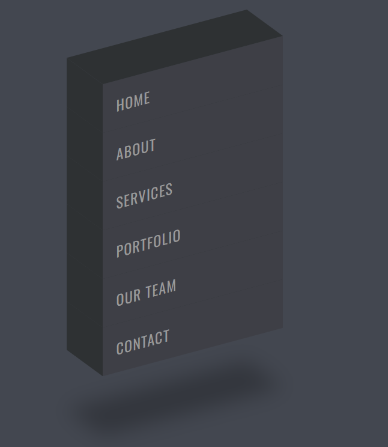
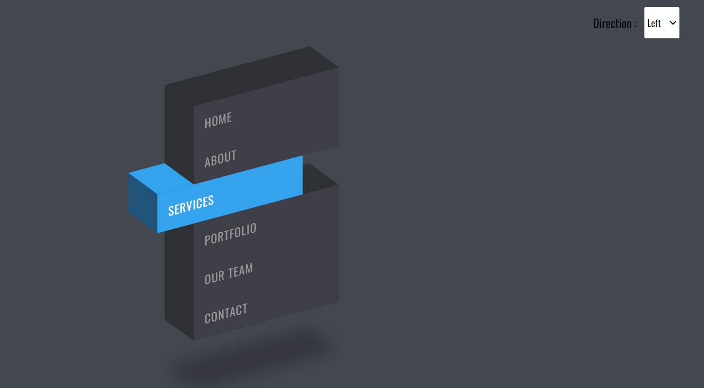
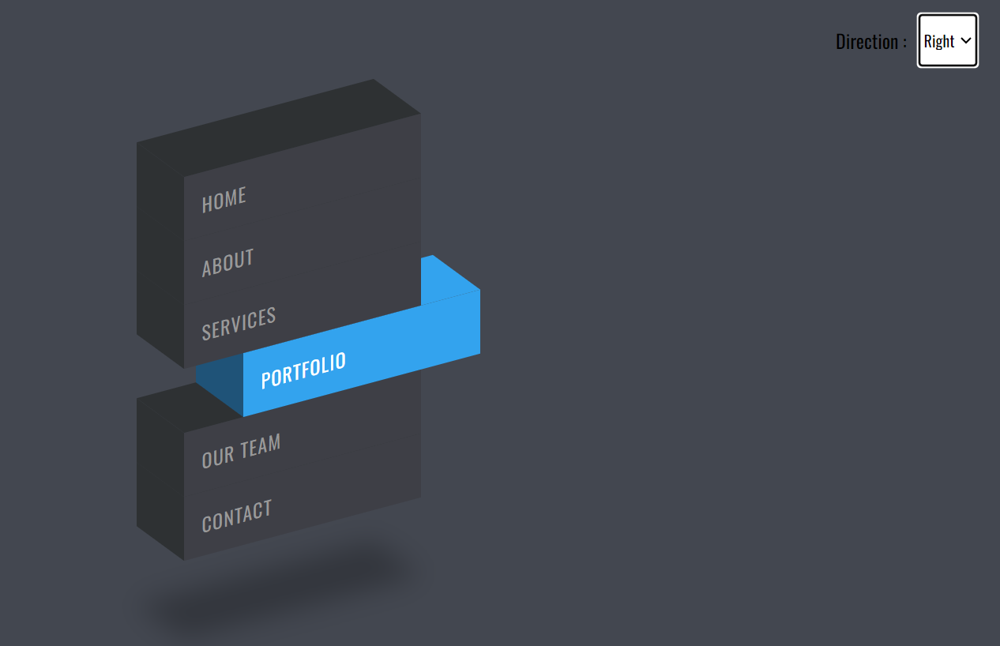

# CSS Isometric Menu
- Created an Isometric 3D Menu using just HTML, CSS and JavaScript.
- Responsive CSS
- Hovering Effect 
- Getting 3D look using 2D skew

### Menu Demo

### Enhancements
- I added one feature where I integrated a Dropdown. Based on the selection of Left or Right direction, the element would hovered to the selected direction.

### Reference
- .